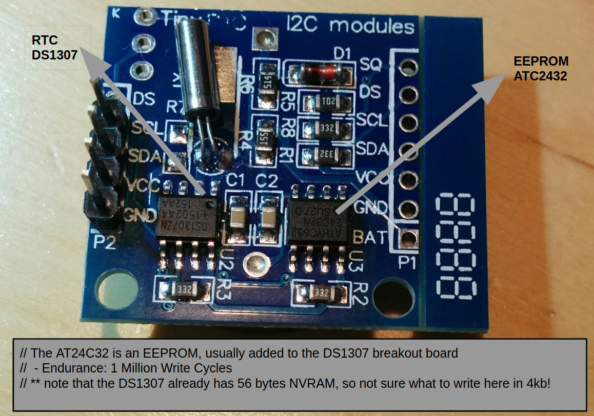

# AT24C32
AT24C32 EEprom with 32k or 64k. This code has **MaxMemSize** set as 32k bits (4096kb)

The sample .ino also explains how to add **Serial.printf** to your arduino code.

* The AT24C32 is an EEPROM, usually added to the DS1307 breakout board
  * Endurance: 1 Million Write Cycles
  * note that the DS1307 already has 56 bytes NVRAM, so not sure what to write here in 4kb!

## Calls available
	void begin(int sda, int scl);
	bool WriteBytes(uint16_t StartAddress,uint16_t SizeOfVar,void* ValToWrite);
	bool WriteBytes(uint16_t StartAddress,char* ValToWrite);
	bool RetrieveBytes(char* buf, uint16_t StorageVarSize, uint16_t StartAddress, bool ZeroTerminated);
	void SetMemLoc(uint16_t address);

The memory is internally organized as 256 pages of 32 bytes each. The code works with this limitation.

> **IMPORTANT:** There is also **write protection** and a cycle memory reset sequence that can be called, but not implemented here
