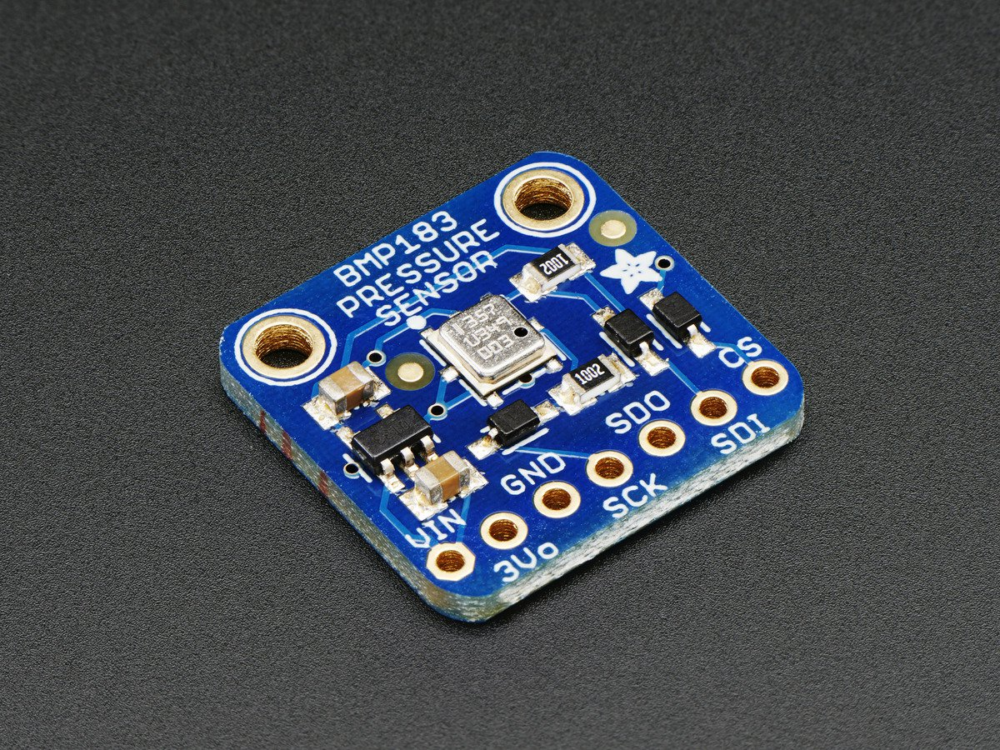

# Adafruit BMP183 
 
This is a library for our Adafruit BMP183 SPI Barometric Pressure & Altitude Sensor and it's based on [Adafruit Unified Sensor Library](https://github.com/adafruit/Adafruit_Sensor).

Pick one up today in the adafruit shop!
  * https://www.adafruit.com/products/1900

These Sensors use SPI to communicate, 4 pins are required to interface

Adafruit invests time and resources providing this open source code, please support Adafruit and open-source hardware by purchasing products from Adafruit!

Written by Limor Fried/Ladyada  for Adafruit Industries. BSD license, check license.txt for more information. 

All text above must be included in any redistribution

## About the BMP183 ##

This precision sensor from Bosch is the best low-cost sensing solution for measuring barometric pressure and temperature. Because pressure changes with altitude you can also use it as an altimeter! 

## What is the Adafruit Unified Sensor Library? ##

The Adafruit Unified Sensor Library ([Adafruit_Sensor](https://github.com/adafruit/Adafruit_Sensor)) provides a common interface and data type for any supported sensor.  It defines some basic information about the sensor (sensor limits, etc.), and returns standard SI units of a specific type and scale for each supported sensor type.

It provides a simple abstraction layer between your application and the actual sensor HW, allowing you to drop in any comparable sensor with only one or two lines of code to change in your project (essentially the constructor since the functions to read sensor data and get information about the sensor are defined in the base Adafruit_Sensor class).

This is imporant useful for two reasons:

1.) You can use the data right away because it's already converted to SI units that you understand and can compare, rather than meaningless values like 0..1023.

2.) Because SI units are standardised in the sensor library, you can also do quick sanity checks when working with new sensors, or drop in any comparable sensor if you need better sensitivity or if a lower cost unit becomes available, etc. 

Light sensors will always report units in lux, gyroscopes will always report units in rad/s, etc. ... freeing you up to focus on the data, rather than digging through the datasheet to understand what the sensor's raw numbers really mean.

## About this Driver ##

Adafruit invests time and resources providing this open source code.  Please support Adafruit and open-source hardware by purchasing products from Adafruit!

Written by Kevin (KTOWN) Townsend for Adafruit Industries.
